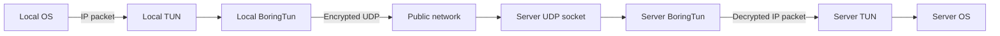

<div align="center">


# Borealis

**An experimental point-to-point WireGuard tunnel built in Rust with BoringTun.**


[Overview](#overview) • [How it works](#how-it-works) • [Getting started](#getting-started) • [Troubleshooting](#troubleshooting)

</div>

Borealis creates a TUN interface, encrypts its IP traffic with [BoringTun](https://github.com/cloudflare/boringtun), and transports the resulting WireGuard packets over UDP. A coordination service registers nodes, allocates overlay addresses, maintains leases, and introduces the two tunnel peers.

> [!WARNING]
> Borealis is an early-stage learning project, not a production VPN. It currently uses panic-based error handling, has no automated tests, and supports exactly two active nodes in one global network.

## Overview

- Userspace WireGuard handshake, encryption, and timers through BoringTun
- Coordinator-assigned IPv4 TUN addresses from `10.0.0.2` through `10.0.0.254`
- Persistent, locally generated X25519 node identities
- Coordinator-provided peer keys and observed endpoints
- Five-minute registrations renewed by periodic heartbeats
- Persistent keepalive every 25 seconds
- Synchronous three-loop architecture using standard Rust threads

The current topology connects two coordinator-discovered nodes:

```text
Node A                    Coordinator                    Node B
  │ register key + port ──────┤                            │
  │                           ├────── register key + port ◀─┤
  │◀──── assigned IP + peer endpoint/key ──────────────────▶│
  │                                                        │
  └──────────────── encrypted UDP tunnel ──────────────────┘
```

The coordinator observes each node's HTTP source IP and combines it with the UDP port advertised by that node. This is discovery, not complete NAT traversal: a translated UDP port may differ from the local port, and at least one reachable endpoint or a later UDP rendezvous mechanism may still be required.

## How it works



Three loops share the tunnel state:

1. **TUN to UDP** reads plaintext IP packets, encapsulates them with BoringTun, and sends encrypted output to the current peer.
2. **UDP to TUN** receives WireGuard packets, processes all pending BoringTun results, sends protocol responses, and writes decrypted packets to TUN.
3. **Timer processing** runs every 250 ms to drive handshake retries and keepalives.

A typical handshake looks like this:

```text
Local   -> Server   148-byte handshake initiation
Server  -> Local     92-byte handshake response
Local   -> Server   encrypted transport packets
```

## Prerequisites

- Linux with TUN/TAP support (`/dev/net/tun`)
- A recent Rust toolchain with Rust 2024 edition support
- Root access or the capabilities required to create and configure a TUN device
- A running Borealis coordinator and PostgreSQL database
- Network paths that permit the nodes' selected UDP ports

## Getting started

### 1. Build Borealis

```bash
cargo build
```

### 2. Configure each node

Create `.env` in the repository root:

```dotenv
COORDINATOR_URL="http://<coordinator-host>:8080"
```

On first start, each node generates `.borealis.key` with owner-only permissions. Keep this file private and persistent: deleting it creates a new node identity. Set `BOREALIS_KEY_PATH` only when the identity should be stored elsewhere.

### 3. Run both peers

Start Borealis on both nodes:

```bash
sudo cargo run
```

The first node registers and waits while continuing to renew its lease. Once the second node registers, both receive their coordinator-assigned addresses. Generate traffic toward the peer address shown in the logs:

```bash
ping <peer-overlay-ip>
```

Routing outside this directly connected tunnel network is not configured by Borealis.

## Configuration

| Variable | Required | Description |
| --- | --- | --- |
| `COORDINATOR_URL` | Yes | Base HTTP URL of the coordination service. |
| `BOREALIS_KEY_PATH` | No | Persistent identity path; defaults to `.borealis.key`. |

The UDP transport currently binds automatically to `0.0.0.0:0`. The TUN interface uses an MTU of 1420 and an IPv4 `/24` netmask. BoringTun is initialized without a preshared key or rate limiter.

## Runtime logs

Useful messages include:

```text
TUN -> WG: 84 bytes       # plaintext packet read from TUN
UDP send: 116 bytes       # encrypted transport packet sent
UDP -> WG: 116 bytes      # encrypted packet received
WG -> TUN IPv4: 84 bytes  # packet authenticated, decrypted, and written to TUN
TIMER -> UDP: 32 bytes    # keepalive/empty transport packet
```

Seeing `UDP send` only proves the local kernel accepted a datagram; UDP does not confirm remote delivery.

## Troubleshooting

### The server never logs `UDP -> WG`

Check each network boundary independently:

```bash
# Does traffic reach the server interface?
sudo tcpdump -ni any 'udp port <selected-port>'

# Is Borealis listening on the expected port?
sudo ss -lunp

# Does the host firewall allow that port?
sudo ufw status verbose
sudo ufw allow <selected-port>/udp
```

`tcpdump` may observe a packet before the host firewall drops it. Therefore, seeing traffic on `eth0` does not prove that Borealis's UDP socket received it.

### Handshake initiations repeat

Repeated 148-byte timer packets mean BoringTun is retrying an unanswered handshake. Verify:

- the coordinator-provided peer IP and UDP port;
- host and cloud firewall rules;
- that both nodes retained their generated identity files;
- that both peers are running the same current build.

### Packets reach TUN but receive no reply

Send traffic to the peer overlay address reported in the discovery log, not an arbitrary address in the `/24`. Borealis does not configure routing for unassigned addresses.

## Project structure

```text
crates/
├── node/                    Existing tunnel node application
│   └── src/
│       ├── main.rs          Application composition and startup
│       ├── config.rs        Coordinator and identity-path configuration
│       ├── coordinator.rs   Registration, lease, and peer discovery client
│       ├── identity.rs      Persistent X25519 node identity
│       ├── peer.rs          Mutable peer endpoint state
│       ├── transport.rs     UDP socket binding
│       ├── tun_device.rs    TUN interface creation
│       └── tunnel.rs        Packet processing and protocol timer loops
└── protocol/                Shared control-plane HTTP contract
    └── src/lib.rs
services/
└── coordinator/             PostgreSQL-backed coordination service
    ├── migrations/          Coordinator database schema
    └── src/main.rs
```

The root is a Cargo workspace. `cargo run` continues to run the node through
the workspace's default member. Run the coordinator independently
with `cargo run -p borealis-coordinator`.

## Current limitations

- Linux-oriented and dependent on privileged TUN creation
- Exactly one peer in one global coordinator-managed network
- No route, DNS, forwarding, or cleanup management
- No CLI, automated tests, or graceful shutdown
- IPv6 packets are processed even though only IPv4 tunnel addresses are configured
- Most runtime failures panic instead of recovering cleanly
- Incoming source addresses update the learned endpoint before packet authentication

This repository is best treated as a compact prototype for learning how TUN devices, UDP transport, NAT traversal, and the WireGuard state machine fit together.
