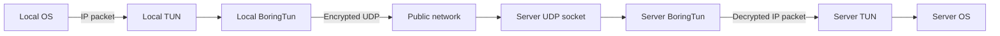

<div align="center">

# Borealis

**An experimental point-to-point WireGuard tunnel built in Rust with BoringTun.**


[Overview](#overview) • [How it works](#how-it-works) • [Getting started](#getting-started) • [Troubleshooting](#troubleshooting)

</div>

Borealis creates a TUN interface, encrypts its IP traffic with [BoringTun](https://github.com/cloudflare/boringtun), and transports the resulting WireGuard packets over UDP. It is designed around a local machine behind NAT connecting to a publicly reachable server that learns the local machine's translated endpoint.

> [!WARNING]
> Borealis is an early-stage learning project, not a production VPN. It currently uses panic-based error handling, has no automated tests, and learns peer endpoints before authenticating incoming packets.

## Overview

- Userspace WireGuard handshake, encryption, and timers through BoringTun
- IPv4 TUN addresses `10.0.0.9` and `10.0.0.10`
- NAT-friendly local endpoint using an OS-assigned UDP port
- Learned remote endpoint on the publicly reachable node
- Persistent keepalive every 25 seconds
- Synchronous three-loop architecture using standard Rust threads

The current topology expects one stable, reachable node:

```text
Local machine behind NAT                       Public server
10.0.0.9                                      10.0.0.10
UDP 0.0.0.0:0                                 UDP 0.0.0.0:41802
configured server endpoint  ────────────────> learns local NAT endpoint
```

Two dynamic peers cannot discover one another without a stable endpoint, port forwarding, or a separate rendezvous service. Borealis uses the public server as that stable endpoint.

## How it works



Three loops share the tunnel state:

1. **TUN to UDP** reads plaintext IP packets, encapsulates them with BoringTun, and sends encrypted output to the current peer.
2. **UDP to TUN** receives WireGuard packets, processes all pending BoringTun results, sends protocol responses, and writes decrypted packets to TUN.
3. **Timer processing** runs every 250 ms to drive handshake retries and keepalives.

A typical handshake looks like this:

```text
Local   -> Server   148-byte handshake initiation
Server  -> Local     92-byte handshake response
Local   -> Server   encrypted transport packets
```

## Prerequisites

- Linux with TUN/TAP support (`/dev/net/tun`)
- A recent Rust toolchain with Rust 2024 edition support
- Root access or the capabilities required to create and configure a TUN device
- One publicly reachable machine with a stable UDP port
- Matching X25519 keypairs for the two peers

The server firewall must allow the UDP port used by `BIND_SOCKET`. For the examples below:

```bash
sudo ufw allow 41802/udp
```

If your provider also has a cloud firewall, allow the same UDP port there.

## Getting started

### 1. Build Borealis

```bash
cargo build
```

### 2. Prepare keys

Each peer needs:

- its own 32-byte X25519 private key;
- the other peer's corresponding 32-byte public key.

Borealis currently accepts keys as JSON arrays of exactly 32 byte values.

> [!CAUTION]
> Never commit `.env` files or share private keys. If a private key is exposed, rotate that keypair and update the other peer's `PEER_PUBLIC_KEY`.

### 3. Configure the local machine

Create `.env` in the repository root:

```dotenv
NODE=0
BIND_SOCKET="0.0.0.0:0"
PEER_SOCKET="<server-public-ip>:41802"
PRIVATE_KEY="[<32 private-key bytes>]"
PEER_PUBLIC_KEY="[<32 server-public-key bytes>]"
```

Port `0` asks the OS to choose an available local UDP port. NAT may translate it again; the server replies to the endpoint observed on the incoming handshake.

### 4. Configure the public server

Create `.env` in the server checkout:

```dotenv
NODE=1
BIND_SOCKET="0.0.0.0:41802"
PRIVATE_KEY="[<32 private-key bytes>]"
PEER_PUBLIC_KEY="[<32 local-public-key bytes>]"
```

Do not set `PEER_SOCKET` on the server. It starts without a known local endpoint and learns one after receiving local traffic. Omit the variable entirely—an empty value is not a valid socket address.

### 5. Run both peers

Start the server first:

```bash
sudo cargo run
```

Then start the local peer:

```bash
sudo cargo run
```

Generate traffic toward the server's tunnel address:

```bash
ping 10.0.0.10
```

The local tunnel address is `10.0.0.9`; the server tunnel address is `10.0.0.10`. Routing outside this directly connected tunnel network is not configured by Borealis.

## Configuration

| Variable | Required | Description |
| --- | --- | --- |
| `NODE` | Yes | `0` assigns `10.0.0.9`; any other integer assigns `10.0.0.10`. |
| `BIND_SOCKET` | Yes | Local UDP bind address. Use `0.0.0.0:0` locally or a stable port on the server. |
| `PEER_SOCKET` | Local only | Initial remote UDP endpoint. Omit it on the endpoint-learning server. |
| `PRIVATE_KEY` | Yes | Own X25519 private key as a JSON array of 32 bytes. |
| `PEER_PUBLIC_KEY` | Yes | Other peer's X25519 public key as a JSON array of 32 bytes. |

The TUN interface uses an MTU of 1420 and an IPv4 `/24` netmask. BoringTun is initialized without a preshared key or rate limiter.

## Runtime logs

Useful messages include:

```text
TUN -> WG: 84 bytes       # plaintext packet read from TUN
UDP send: 116 bytes       # encrypted transport packet sent
UDP -> WG: 116 bytes      # encrypted packet received
WG -> TUN IPv4: 84 bytes  # packet authenticated, decrypted, and written to TUN
TIMER -> UDP: 32 bytes    # keepalive/empty transport packet
```

Seeing `UDP send` only proves the local kernel accepted a datagram; UDP does not confirm remote delivery.

## Troubleshooting

### The server never logs `UDP -> WG`

Check each network boundary independently:

```bash
# Does traffic reach the server interface?
sudo tcpdump -ni any 'udp dst port 41802'

# Is Borealis listening on the expected port?
sudo ss -lunp | grep 41802

# Does the host firewall allow that port?
sudo ufw status verbose
sudo ufw allow 41802/udp
```

`tcpdump` may observe a packet before the host firewall drops it. Therefore, seeing traffic on `eth0` does not prove that Borealis's UDP socket received it.

### Handshake initiations repeat

Repeated 148-byte timer packets mean BoringTun is retrying an unanswered handshake. Verify:

- the server IP and UDP port;
- host and cloud firewall rules;
- that each `PEER_PUBLIC_KEY` belongs to the other peer's private key;
- that both peers are running the same current build.

### Packets reach TUN but receive no reply

Send traffic to the configured peer address. The server owns `10.0.0.10`, not arbitrary addresses in the `/24`. A packet for another address may cross the tunnel successfully but receive no response unless the server owns or routes that address.

## Project structure

```text
crates/
├── node/                    Existing tunnel node application
│   └── src/
│       ├── main.rs          Application composition and startup
│       ├── config.rs        Environment configuration and tunnel addressing
│       ├── peer.rs          Mutable peer endpoint state
│       ├── transport.rs     UDP socket binding
│       ├── tun_device.rs    TUN interface creation
│       └── tunnel.rs        Packet processing and protocol timer loops
└── protocol/                Shared control-plane contract (scaffold)
    └── src/lib.rs
services/
└── coordinator/             Independently runnable coordination service
    ├── migrations/          Future PostgreSQL migrations
    └── src/main.rs
```

The root is a Cargo workspace. `cargo run` continues to run the node through
the workspace's default member. Run the coordinator scaffold independently
with `cargo run -p borealis-coordinator`.

## Current limitations

- Linux-oriented and dependent on privileged TUN creation
- Exactly one peer and fixed tunnel addresses
- No route, DNS, forwarding, or cleanup management
- No CLI, key-generation utility, tests, or graceful shutdown
- IPv6 packets are processed even though only IPv4 tunnel addresses are configured
- Most runtime failures panic instead of recovering cleanly
- Incoming source addresses update the learned endpoint before packet authentication

This repository is best treated as a compact prototype for learning how TUN devices, UDP transport, NAT traversal, and the WireGuard state machine fit together.
