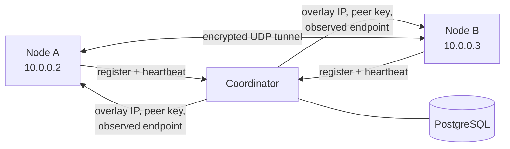

<div align="center">


# Borealis

**A coordinator-discovered, point-to-point WireGuard tunnel built in Rust.**


[Overview](#overview) • [Architecture](#architecture) • [Getting started](#getting-started) • [Configuration](#configuration) • [Troubleshooting](#troubleshooting)

</div>

Borealis connects two Linux nodes through an encrypted userspace WireGuard tunnel. A PostgreSQL-backed coordinator registers node identities, allocates overlay addresses, tracks leases, and introduces peers. The data plane then runs directly between the nodes over UDP; tunnel traffic does not pass through the coordinator.

> [!WARNING]
> Borealis is an experimental learning project, not a production VPN. It has no control-plane authentication, supports exactly two active nodes in one global network, and still uses panic-based error handling in several runtime paths.

## Overview

- Userspace WireGuard handshake, encryption, keepalives, and timers through [BoringTun](https://github.com/cloudflare/boringtun)
- Linux TUN interfaces with coordinator-assigned addresses in `10.0.0.0/24`
- Persistent X25519 identities generated locally with owner-only file permissions
- PostgreSQL-backed registration, address allocation, endpoint discovery, and five-minute leases
- Automatic lease renewal every 60 seconds
- Peer endpoint roaming based on accepted WireGuard traffic
- Configurable UDP binding for publicly reachable nodes
- Synchronous packet processing supervised across dedicated worker threads

## Architecture



Each node follows this startup sequence:

1. Load its persistent private key, or generate one on first start.
2. Bind its UDP transport and derive its public key.
3. Register the public key and UDP port with the coordinator.
4. Receive a stable node ID, overlay IP, and five-minute lease.
5. Renew the lease in the background and poll until one peer is available.
6. Configure the TUN interface and initialize BoringTun with the discovered peer key.
7. Send encrypted traffic directly to the peer's discovered UDP endpoint.

The coordinator observes the source IP of each HTTP registration and combines it with the UDP listen port advertised by the node. When valid WireGuard traffic arrives from a different address, Borealis updates the peer endpoint to the address actually observed by the UDP socket. This supports common NAT port translation when one node can initiate traffic toward a reachable peer.

> [!IMPORTANT]
> Coordinator discovery is not full NAT traversal. The current topology expects at least one node to be publicly reachable on a stable UDP port. Two nodes behind restrictive NAT may require port forwarding or a future UDP rendezvous mechanism.

### Data plane

Three workers share one BoringTun state machine:

1. **TUN to UDP** reads IP packets, encrypts them, and sends WireGuard packets to the current peer endpoint.
2. **UDP to TUN** receives WireGuard packets, writes decrypted IP packets to the TUN interface, and sends protocol responses.
3. **Timer processing** runs every 250 ms to drive handshakes, retries, rekeying, and the 25-second persistent keepalive.

```text
Local kernel → TUN → BoringTun → UDP → BoringTun → TUN → Remote kernel
```

## Prerequisites

### Coordinator

- Linux server
- PostgreSQL
- Rust toolchain when building on the server, or a compatible prebuilt binary
- Reachable TCP port for the HTTP API

### Nodes

- Linux with `/dev/net/tun`
- Root access or `CAP_NET_ADMIN`
- Network access to the coordinator
- A reachable UDP port on at least one node

## Getting started

### 1. Build the workspace

```bash
cargo build --workspace
```

For deployment binaries:

```bash
cargo build --release -p borealis-coordinator
cargo build --release -p borealis-node
```

The resulting executables are:

```text
target/release/borealis-coordinator
target/release/borealis
```

### 2. Prepare PostgreSQL

Create a role and database:

```bash
sudo -u postgres psql
```

```sql
CREATE ROLE borealis LOGIN;
\password borealis
CREATE DATABASE borealis OWNER borealis;
\q
```

Apply the schema from the repository root:

```bash
export DATABASE_URL="postgres://borealis:<password>@127.0.0.1:5432/borealis"
psql "$DATABASE_URL" \
  -f services/coordinator/migrations/20260816234341_create_nodes.sql
```

### 3. Run the coordinator

Create `.env` in the coordinator's working directory:

```dotenv
DATABASE_URL="postgres://borealis:<password>@127.0.0.1:5432/borealis"
BIND_ADDRESS="0.0.0.0:8080"
```

Start it from that directory:

```bash
cargo run -p borealis-coordinator
```

Or run a deployed binary:

```bash
/usr/local/bin/borealis-coordinator
```

Allow inbound TCP traffic to the configured coordinator port in both the host and cloud firewalls.

### 4. Configure the publicly reachable node

Create `.env` in its working directory:

```dotenv
COORDINATOR_URL="http://<coordinator-host>:8080"
BOREALIS_KEY_PATH="/var/lib/borealis/private.key"
BIND_SOCKET="0.0.0.0:41802"
```

Prepare the identity directory and allow the fixed UDP port:

```bash
sudo mkdir -p /var/lib/borealis
sudo chmod 700 /var/lib/borealis
sudo ufw allow 41802/udp
```

If the server has a cloud firewall, allow UDP `41802` there as well.

Start the node as root so it can create its TUN interface:

```bash
sudo /usr/local/bin/borealis
```

### 5. Configure the initiating node

Create `.env` in the repository or binary working directory:

```dotenv
COORDINATOR_URL="http://<coordinator-host>:8080"
```

The default UDP bind address is `0.0.0.0:0`, so the OS selects a local port. The default identity path is `.borealis.key`.

Start the node:

```bash
sudo cargo run
```

The first node waits for a peer while renewing its lease. After both nodes register, each logs its assigned overlay IP and discovered peer endpoint.

### 6. Verify the tunnel

If the nodes receive `10.0.0.2` and `10.0.0.3`, test from either side:

```bash
ping 10.0.0.3
```

Confirm the route and TUN address:

```bash
ip route get 10.0.0.3
ip -brief address
```

Observe decrypted ICMP traffic on the peer:

```bash
sudo tcpdump -ni tun0 -vv icmp
```

A successful capture contains both directions:

```text
10.0.0.2 > 10.0.0.3: ICMP echo request
10.0.0.3 > 10.0.0.2: ICMP echo reply
```

## Configuration

### Node

| Variable | Required | Default | Description |
| --- | --- | --- | --- |
| `COORDINATOR_URL` | Yes | — | Base HTTP URL of the coordinator. |
| `BOREALIS_KEY_PATH` | No | `.borealis.key` | Persistent 32-byte private identity file. |
| `BIND_SOCKET` | No | `0.0.0.0:0` | UDP bind address. Public nodes should use a stable port. |
| `RUST_LOG` | No | `info` | Tracing filter, such as `borealis=debug,boringtun=debug`. |

The identity file is generated once with mode `0600`. Keep it private and persistent. The public key is derived from it on every startup, and the coordinator uses that public key to return the same node ID and overlay IP. Deleting the file creates a new node identity.

### Coordinator

| Variable | Required | Description |
| --- | --- | --- |
| `DATABASE_URL` | Yes | PostgreSQL connection URL. |
| `BIND_ADDRESS` | Yes | HTTP listen address, for example `0.0.0.0:8080`. |

### Coordinator API

| Method | Path | Purpose |
| --- | --- | --- |
| `POST` | `/v1/nodes/register` | Register or refresh a node identity and allocate its overlay IP. |
| `POST` | `/v1/nodes/{node_id}/heartbeat` | Refresh the observed endpoint and five-minute lease. |
| `GET` | `/v1/nodes/{node_id}/peers` | Return other active, non-expired peers. |

Registration is idempotent for a retained private key. A repeated public key updates its endpoint and lease without changing its node ID or overlay IP. Overlay addresses are allocated from `10.0.0.2` through `10.0.0.254`; `.0` is the network address, `.1` is reserved, and `.255` is the broadcast address.

## Runtime logging

Use debug logging to inspect the complete packet path:

```bash
sudo env RUST_LOG=borealis=debug,boringtun=debug ./target/debug/borealis
```

Useful messages include:

```text
read packet from TUN
sending UDP packet
received UDP packet
WireGuard produced IPv4 TUN packet
peer endpoint changed
```

`HANDSHAKE(REKEY_TIMEOUT)` means the node sent a handshake but did not complete it. A successful connection logs a received handshake response and a new BoringTun session at debug level.

## Troubleshooting

### TUN creation returns `Operation not permitted`

Run the node as root:

```bash
sudo ./target/debug/borealis
```

Alternatively, grant the built binary network-administration capability:

```bash
sudo setcap cap_net_admin+ep ./target/debug/borealis
```

### The node cannot contact the coordinator

On the coordinator, confirm the process is listening:

```bash
ss -ltnp | grep 8080
curl -i http://127.0.0.1:8080/v1/nodes/1/peers
```

Check the host and cloud firewalls for inbound TCP access to the configured port.

### PostgreSQL reports `relation "nodes" does not exist`

Apply the included migration:

```bash
psql "$DATABASE_URL" \
  -f services/coordinator/migrations/20260816234341_create_nodes.sql
```

### Handshakes repeatedly time out

Verify that:

- the discovered endpoint matches the reachable node's current UDP port;
- the reachable node uses a fixed `BIND_SOCKET`;
- host and cloud firewalls allow that UDP port;
- both nodes retain their original identity files;
- both nodes are running compatible builds.

Capture the public UDP path on the reachable peer:

```bash
sudo tcpdump -ni any udp port 41802
```

### UDP arrives but ping does not reply

Trace each boundary independently:

```bash
sudo tcpdump -ni tun0 -vv icmp
sudo tcpdump -ni any udp port 41802
```

The first command confirms decrypted overlay traffic; the second confirms encrypted transport traffic.

## Project structure

```text
crates/
├── node/
│   └── src/
│       ├── main.rs          Startup and component composition
│       ├── config.rs        Node environment configuration
│       ├── coordinator.rs   Registration, heartbeat, and peer discovery client
│       ├── identity.rs      Persistent X25519 node identity
│       ├── peer.rs          Mutable peer endpoint state
│       ├── transport.rs     UDP transport binding
│       ├── tun_device.rs    Linux TUN configuration
│       └── tunnel.rs        WireGuard packet and timer workers
└── protocol/
    └── src/lib.rs           Shared control-plane request and response types
services/
└── coordinator/
    ├── migrations/          PostgreSQL schema
    └── src/                 Axum coordinator service
```

## Current limitations

- Exactly two active nodes in one global network
- One BoringTun peer per node
- No coordinator authentication or network membership authorization
- No full NAT traversal or UDP hole-punching service
- No periodic peer-map refresh after tunnel startup
- No route, DNS, forwarding, or interface cleanup management
- Linux-only TUN setup with IPv4 overlay addressing
- No graceful shutdown or automated tests
- Several runtime failures still panic instead of recovering

Borealis is best treated as a compact prototype for studying how identity, coordination, TUN devices, UDP transport, NAT endpoint roaming, and the WireGuard state machine fit together.
